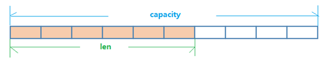
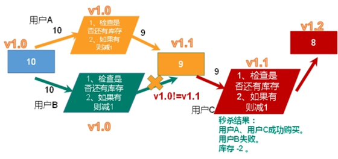
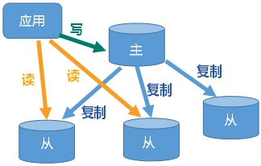
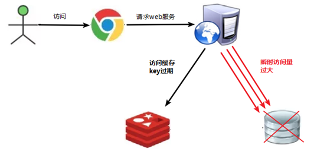
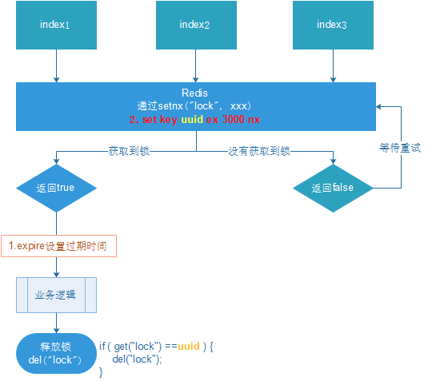

[TOC]

# Redis

## NoSQL

not only sql, 非关系型数据库

- Memcache： 数据都在内存中，一般不持久化，支持简单的key-value模式

- Redis：数据都在内存中，支持持久化，支持简单的key-value模式，还支持多种数据结构的存储，比如 list、set、hash、zset等。
- MongoDB：文档型数据库，数据都在内存中， 如果内存不足，把不常用的数据保存到硬盘。key-value模式，但是对value（尤其是json）提供了丰富的查询功能。支持二进制数据及大型对象。

默认6379端口。默认16个数据库，0-based。

## 单线程+多路IO复用技术

多路复用是指使用一个线程来检查多个文件描述符（Socket）的就绪状态，比如调用select和poll函数，传入多个文件描述符，如果有一个文件描述符就绪，则返回，否则阻塞直到超时。得到就绪状态后进行真正的操作可以在同一个线程里执行，也可以启动线程执行（比如使用线程池）

## Redis数据类型（Key）

`String`, `list`(quicklist), `set`(无序集合), `hash`(ziplist, hashtable), `Zset`(有序集合, hash, 跳表)

### 1.String数据类型

String类型是二进制安全的。意味着Redis的string可以包含任何数据。比如jpg图片或者序列化的对

#### String数据结构

String的数据结构为简单动态字符串(Simple Dynamic String,缩写SDS)。是可以修改的字符串，内部结构实现上类似于Java的ArrayList，采用预分配冗余空间的方式来减少内存的频繁分配.

如图中所示，内部为当前字符串实际分配的空间capacity一般要高于实际字符串长度len。当字符串长度小于1M时，扩容都是加倍现有的空间，如果超过1M，扩容时一次只会多扩1M的空间。需要注意的是字符串最大长度为512M。

### 2.List数据类型

Redis 列表是简单的字符串列表，按照插入顺序排序。

#### list数据结构

List的数据结构为快速链表**quickList**。

首先在列表元素较少的情况下会使用一块连续的内存存储，这个结构是**ziplist**，也即是**压缩列表**。

它将所有的元素紧挨着一起存储，分配的是一块连续的内存。

当数据量比较多的时候才会改成quicklist。**因为普通的链表需要的附加指针空间太大，会比较浪费空间。**

### 3.Set数据类型

Redis的Set是string类型的无序集合。它底层其实是一个**value为null的hash表**，所以添加，删除，查找的复杂度都是O(1)。

#### Set数据结构

Set数据结构是**dict字典**，字典是用哈希表实现的。

Java中HashSet的内部实现使用的是HashMap，只不过所有的value都指向同一个对象。Redis的set结构也是一样，它的内部也使用hash结构，所有的value都指向同一个内部值。

### 4.Hash数据类型

Redis hash是一个string类型的**field和value的映射表**，hash特别**适合用于存储对象**。

类似Java里面的Map<String,Object>

用户ID为查找的key，存储的value用户对象包含姓名，年龄，生日等信息，如果用普通的key/value结构来存储

有点类似与json格式。

#### Hash数据结构

Hash类型对应的数据结构是两种**：ziplist（压缩列表**），**hashtable（哈希表）**。当field-value长度较短且个数较少时，使用ziplist，否则使用hashtable。

### 5.Zset数据类型

Redis**有序集合z**set与普通集合set非常相似，是一个没有重复元素的字符串集合。

不同之处是有序集合的**每个成员都关联了一个评分（score）**,这个评分（score）被用来按照从最低分到最高分的方式排序集合中的成员。集合的**成员是唯一的**，但是**评分可以是重复**了 。

可以很快的根据评分（score）或者次序（position）来获取一个范围的元素。

访问有序集合的中间元素也是非常快的,因此你能够使用有序集合作为一个没有重复成员的智能列表。

#### Zset数据结构

SortedSet(zset)是Redis提供的一个非常特别的数据结构，一方面它等价于Java的数据结构Map<String, Double>，可以给每一个元素value赋予一个权重score，另一方面它又类似于TreeSet，内部的元素会按照权重score进行排序，可以得到每个元素的名次，还可以通过score的范围来获取元素的列表。

zset底层使用了两个数据结构

（1）hash，hash的作用就是**关联元素value和权重score**，保障元素value的唯一性，可以**通过元素value找到相应的score值**。

（2）跳跃表，**跳跃表的目的在于给元素value排序**，根据score的范围获取元素列表。

### 跳表

对于有序集合的底层实现，可以用数组、平衡树、链表等。

- 数组不便元素的插入、删除；

- 平衡树或红黑树虽然效率高但结构复杂；

- 链表查询需要遍历所有效率低。

Redis采用的是跳跃表。**跳跃表效率堪比红黑树，实现远比红黑树简单**。

跳跃表比有序链表效率要高.

## Redis的发布和订阅

Redis 发布订阅 (pub/sub) 是一种**消息通信模式**：发送者 (pub) 发送消息，订阅者 (sub) 接收消息。

**Redis 客户端**可以订阅**任意数量**的频道。

## BitMaps

（1）  Bitmaps本身不是一种数据类型， **实际上它就是字符串（key-value）** ， 但是它可以**对字符串的位**进行操作。

（2）在Redis中使用Bitmaps和使用字符串的方法不太相同。 可以把Bitmaps想象成一个以位为单位的数组， 数组的每个单元只能存储0和1， 数组的下标在Bitmaps中叫做偏移量。

用途：统计网站活跃量等。

## HyperLogLog

网站PV（PageView页面访问量）。

像UV（UniqueVisitor，独立访客）、独立IP数、搜索记录数等**需要去重和计数**的问题如何解决？这种求集合中不重复元素个数的问题称为**基数问题。**

Redis HyperLogLog 是用来做**基数统计的算法**，HyperLogLog 的优点是，在输入元素的数量或者体积非常非常大时，计算基数所需的**空间总是固定的**、并且是**很小**的。

**基数估计**就是在**误差可接受**的范围内，**快速计算基数**。

## Geospatial

对GEO类型的支持。GEO，Geographic，地理信息的缩写。

该类型，就是元素的2维坐标，在地图上就是经纬度。

## Redis事务

Multi命令。

- **组队中**某个命令出现了报告错误，执行时整个的所有队列都会被取消。

- **执行阶段**某个命令报出了错误，则只有报错的命令不会被执行，而其他的命令都会执行，不会回滚。

### 悲观锁

每次在拿数据的时候都会上锁。比如**行锁**，**表锁**等，**读锁**，**写锁**等，都是在做操作之前先上锁。

### 乐观锁

watch命令

**不会上锁**，但是在更新的时候会判断一下在此期间别人有没有去更新这个数据，可以使用**版本号**等机制。

**乐观锁适用于多读的应用类型，这样可以提高吞吐量**。Redis就是利用这种`check-and-set`机制实现事务的。

## 超卖问题

利用乐观锁淘汰用户，解决超卖问题。比较版本大小。

## 连接池解决超时问题

通过连接池解决

连接池参数：

MaxTotal：控制一个pool可分配多少个jedis实例；

maxIdle：最多有多少个状态为idle(空闲)的jedis实例；

MaxWaitMillis：当borrow一个jedis实例时，最大的等待毫秒数，如果超过等待时间，则直接抛JedisConnectionException。

testOnBorrow：获得一个jedis实例的时候是否检查连接可用性（ping()）。

## 库存遗留问题

将复杂的或者多步的redis操作，写为一个脚本，一次提交给redis执行，减少反复连接redis的次数。提升性能。

LUA脚本是类似redis事务，有一定的原子性，不会被其他命令插队，可以完成一些redis事务性的操作。

redis 2.6版本以后，通过lua脚本解决**争抢问题**，实际上是**redis 利用其单线程的特性，用任务队列的方式解决多任务并发问题**。

## Redis持久化之RDB（Redis DataBase）

在**指定的时间间隔**内将内存中的**数据快照写入磁盘**， 也就是行话讲的Snapshot快照，它恢复时是将快照文件直接读到内存里。

### 备份执行

Redis会单独创建**（fork）一个子进程**来进行持久化，会先将数据写入到 一个**临时文件**中，待持久化过程都结束了，再用这个临时文件**替换上次持久化好的文件**。 整个过程中，主进程是不进行任何IO操作的，这就确保了极高的性能。

如果需要进行大规模数据的恢复，且对于数据恢复的完整性不是非常敏感，那RDB方式要比AOF方式更加的高效。**RDB的缺点是最后一次持久化后的数据可能丢失**。

- Fork：作用是复制一个与当前进程一样的进程。新进程的所有数据（变量、环境变量、程序计数器等） 数值都和原进程一致，但是是一个全新的进程，并作为原进程的子进程

### RDB优势

- 适合大规模的数据恢复

- 对数据完整性和一致性要求不高更适合使用

- 节省磁盘空间

- 恢复速度快

### RDB劣势

- Fork的时候，内存中的数据被克隆了一份，**大致2倍的膨胀性**需要考虑

- 虽然Redis在fork时使用了**写时拷贝技术**,但是如果**数据庞大时还是比较消耗性能**。

- 在备份周期在一定间隔时间做一次备份，所以如果Redis意外down掉的话，就会**丢失最后一次快照后的所有修改**。

## Redis持久化之AOF（Append Only File）

以**日志**的形式来记录每个写操作（**增量保存**），将Redis执行过的所有**写指令记录**下来(读操作不记录)， **只许追加文件但不可以改写文件**，redis启动之初会读取该文件重新构建数据，换言之，redis 重启的话就根据日志文件的内容将写指令从前到后执行一次以完成数据的恢复工作。

### 持久化流程

（1）客户端的请求写命令会被append追加到AOF缓冲区内；

（2）AOF缓冲区根据AOF持久化策略[always,everysec,no]将操作sync同步到磁盘的AOF文件中；

（3）AOF文件大小超过重写策略或手动重写时，会对AOF文件rewrite重写，压缩AOF文件容量；

（4）Redis服务重启时，会重新load加载AOF文件中的写操作达到数据恢复的目的；

### 重写原理

AOF文件持续增长而过大时，会fork出一条新进程来将文件重写(也是先写临时文件最后再rename)，redis4.0版本后的重写，是指上就是把rdb 的快照，以二级制的形式附在新的aof头部，作为已有的历史数据，替换掉原来的流水账操作。

（1）bgrewriteaof触发重写，判断是否当前有bgsave或bgrewriteaof在运行，如果有，则等待该命令结束后再继续执行。

（2）主进程fork出子进程执行重写操作，保证主进程不会阻塞。

（3）子进程遍历redis内存中数据到临时文件，客户端的写请求同时写入aof_buf缓冲区和aof_rewrite_buf重写缓冲区保证原AOF文件完整以及新AOF文件生成期间的新的数据修改动作不会丢失。

（4）

1).子进程写完新的AOF文件后，向主进程发信号，父进程更新统计信息。

2).主进程把aof_rewrite_buf中的数据写入到新的AOF文件。

（5）使用新的AOF文件覆盖旧的AOF文件，完成AOF重写。

### AOF优势

备份机制更稳健，丢失数据概率更低。

可读的日志文本，通过操作AOF稳健，可以处理误操作。

### AOF劣势

- 比起RDB占用更多的磁盘空间。

- 恢复备份速度要慢。

- 每次读写都同步的话，有一定的性能压力。

- 存在个别Bug，造成恢复不能。

## AOF和RDB同时开启，redis听谁的？

AOF和RDB同时开启，系统默认取AOF的数据（数据不会存在丢失）

## Redis主从复制

**主机数据更新**后根据配置和策略， **自动同步到备机**的**master/slaver机制**，Master以写为主，Slave以读为主。

- 一主二仆
- 薪火相传

上一个Slave可以是下一个slave的Master，Slave同样可以接收其他 slaves的连接和同步请求，那么该slave作为了链条中下一个的master, 可以有效减轻master的写压力,去中心化降低风险。

- 反客为主

当一个master宕机后，后面的slave可以立刻升为master，其后面的slave不用做任何修改。

### 哨兵模式

**反客为主的自动版**，能够后台监控主机是否故障，如果故障了根据投票数自动将从库转换为主库

## Redis集群

Redis 集群实现了对Redis的水平扩容，即启动N个redis节点，将**整个数据库分布存储在这N个节点中**，每个节点存储总数据的1/N。

Redis 集群通过分区（partition）来提供一定程度的可用性（availability）： 即使集群中有一部分节点失效或者无法进行通讯， 集群也可以继续处理命令请求。

一个集群至少要有三个主节点。

### slots（插槽）

一个 Redis 集群包含 16384 个插槽（hash slot）， **数据库中的每个键都属于这 16384 个插槽的其中一个**， 

集群使用公式 CRC16(key) % 16384 来**计算键 key 属于哪个槽**， 其中 CRC16(key) 语句用于计算键 key 的 CRC16 校验和 。

集群中的每个节点负责处理一部分插槽。 举个例子， 如果一个集群可以有主节点， 其中：

节点 A 负责处理 0 号至 5460 号插槽。

节点 B 负责处理 5461 号至 10922 号插槽。

节点 C 负责处理 10923 号至 16383 号插槽。

### Reids集群优点

- 实现扩容

- 分摊主机写数据压力

- 无中心配置相对简单

### Redis集群不足

多键操作是不被支持的 

多键的Redis事务是不被支持的。lua脚本不被支持

## Redis应用问题

### 缓存穿透（查询不存在的数据，数据库挂掉）

- 问题

key对应的数据在**数据源并不存在**，每次针对此key的请求从**缓存获取不到**，请求都会压到数据源，从而可能**压垮数据源**。比如用一个不存在的用户id获取用户信息，不论缓存还是数据库都没有，若黑客利用此漏洞进行攻击可能压垮数据库。

例如：

主键自增id时没有小于0的，不断用id小于0的数来发请求。

- 解决方案

一般都是恶意用户。

#### 数据库查询结果放缓存，下次再查直接发给客户端（但是攻击者可能会换不同参数）。

#### ip拉黑（但是攻击者也可能会换不同ip）

#### 对参数合法性进行校验

#### 使用布隆过滤器

（1）  **对空值缓存：**如果一个查询返回的数据为空（不管是数据是否不存在），我们仍然<u>把这个空结果（null）进行缓存，设置空结果的过期时间会很短</u>，最长不超过五分钟

（2）  **设置可访问的名单（白名单）：**

使用bitmaps类型<u>定义一个可以访问的名单</u>，名单id作为bitmaps的偏移量，每次访问和bitmap里面的id进行比较，如果访问id不在bitmaps里面，进行拦截，不允许访问。

（3）  **采用布隆过滤器**：(布隆过滤器（Bloom Filter）是1970年由布隆提出的。它实际上是一个很长的二进制向量(位图)和一系列随机映射函数（哈希函数）。布隆过滤器可以用于**检索一个元素是否在一个集合中**。它的优点是<u>空间效率和查询时间都远远超过一般的算法</u>，缺点是有一定的误识别率和删除困难。

将**所有可能存在的数据** **哈希到一个足够大的bitmaps**中，一个**一定不存在的数据会被 这个bitmaps拦截掉**，从而避免了对底层存储系统的查询压力。

（4）**进行实时监控：**当发现Redis的<u>命中率开始急速降低</u>，需要排查访问对象和访问的数据，和运维人员配合，可以设置<u>黑名单</u>限制服务。

### 缓存击穿（一个key(热点数据)突然失效，数据库挂掉）

- 问题

**key对应的数据存在，但在redis中过期**，此时若有大量并发请求过来，这些请求发现缓存过期一般都会从后端DB加载数据并回设到缓存，这个时候大并发的请求可能会瞬间**把后端DB压垮**。

- 解决方案：

key可能会在某些时间点被超高并发地访问，是一种非常**“热点”**的数据。这个时候，需要考虑一个问题：缓存被“击穿”的问题。

解决方案：

#### 缓存不过期（不太好）

#### 使用分布式锁（单体的话就是互斥锁）

（1）**预先设置热门数据**：在redis高峰访问之前，把一些热门数据提前存入到redis里面，加大这些热门数据key的时长

（2）**实时调整**：现场监控哪些数据热门，实时调整key的过期时长

（3）**使用锁**：

​		1）  就是在缓存失效的时候（判断拿出来的值为空），不是立即去load db。

​		2）  先使用缓存工具的某些带成功操作返回值的操作（比如Redis的SETNX）去set一个mutex key（互斥锁）

​		3）  当操作返回成功时，再进行load db的操作，并回设缓存,最后删除mutex key；

​		4）  当操作返回失败，证明有线程在load db，当前线程睡眠一段时间再重试整个get缓存的方法。

### 缓存雪崩（大量key同一时间失效，数据库挂掉）

- 问题

key对应的数据**存在，但在redis中过期**，此时若有大量并发请求过来，这些请求发现缓存过期一般都会从后端DB加载数据并回设到缓存，这个时候大并发的请求可能会瞬间把后端DB压垮。

缓存雪崩与缓存击穿的区别在于**这里针对很多key缓存**，前者则是某一个key

- 解决方案

#### 随机初始化失效时间，使得失效时间分散开

#### 热点数据分散到不同节点

#### 不设置失效时间

#### 定时任务，定时刷缓存

**（1）**  **构建多级缓存架构：**nginx缓存 + redis缓存 +其他缓存（ehcache等）

**（2）**  **使用锁或队列：**

用加锁或者队列的方式保证来保证不会有大量的线程对数据库一次性进行读写，从而避免失效时大量的并发请求落到底层存储系统上。不适用高并发情况

**（3）**  **设置过期标志更新缓存：**

记录缓存数据是否过期（设置提前量），如果过期会触发通知另外的线程在后台去更新实际key的缓存。

**（4）**  **将缓存失效时间分散开：**

比如我们可以在原有的失效时间基础上增加一个随机值，比如1-5分钟随机，这样每一个缓存的过期时间的重复率就会降低，就很难引发集体失效的事件。

## 分布式锁

分布式系统多线程、多进程并且分布在不同机器上，这将使原单机部署情况下的并发控制锁策略失效，单纯的Java API并不能提供分布式锁的能力。为了解决这个问题就需要一种**跨JVM的互斥机制来控制共享资源的访问**，这就是分布式锁要解决的问题！

分布式锁主流的实现方案：

1. 基于数据库实现分布式锁

2. 基于缓存（Redis等）

3. 基于Zookeeper

每一种分布式锁解决方案都有各自的优缺点：

4. 性能：redis最高

5. 可靠性：zookeeper最高

这里，我们就基于redis实现分布式锁。

- 问题

可能会释放其他服务器的锁。

- 解决方案

setnx**获取锁时，设置一个指定的唯一值**（例如：uuid）；释放前获取这个值，**判断是否自己的锁**，防止误删。

